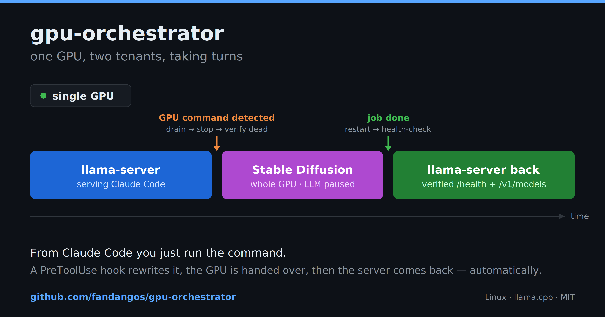

# gpu-orchestrator



[](LICENSE)
[](https://www.python.org/downloads/)
[](#requirements)
[](https://github.com/fandangos/gpu-orchestrator/releases)

Automatic GPU arbitration for llama.cpp servers. Pauses the local LLM server
around VRAM-heavy jobs (Stable Diffusion, ComfyUI, torch training, etc.) and
restores it — health-checked — afterwards. Claude Code keeps working normally;
a GPU command just takes longer.

No more manual `kill llama-server` / restart cycles.

## Architecture

```
Claude Code
  │  Bash tool call
  ▼
PreToolUse hook  claude/gpu-intercept.sh   auto-detects GPU commands,
  │              rewrites to `gpurun -c '…'`, bumps tool timeout
  ▼
gpurun           src/gpu_orchestrator/cli  supervisor — the single GPU gate
  │   flock → grace drain → stop server → verify dead → run job
  │   → trap-guaranteed restore → wait /health + /v1/models
  ▼
lifecycle/process.sh     plain-process driver (default)
lifecycle/systemd.sh     optional systemd --user driver
```

## How it works

1. Claude Code sends a Bash command
2. The PreToolUse hook intercepts it and checks if it matches GPU-heavy patterns
3. If it does, the hook rewrites the command to `gpurun -c '…'`
4. `gpurun` pauses llama-server, runs the command, restores the server, and
   waits for the API to be healthy before returning
5. From Claude's perspective the command just takes 60–120 s longer

## Installation

> **Linux only.** gpu-orchestrator relies on POSIX process groups
> (`os.killpg`), `fcntl` file locks, `crontab`, and `nvidia-smi`. It is not
> supported on macOS or Windows.

```bash
# Clone the repo
git clone <repo-url> gpu-orchestrator
cd gpu-orchestrator

# Recommended: install the package (provides the `gpurun` command + deps)
pip install -e .

# Run the installer (sets up hooks, cron guard, and config)
bash install.sh
```

`pip install -e .` is the recommended path: it puts `gpurun` on your `PATH`
and installs the `psutil`/`pyyaml` dependencies. `install.sh` then detects that
`gpurun` and wires up the rest.

If you skip `pip install`, `install.sh` falls back to writing a `gpurun`
wrapper at `~/.local/bin/gpurun` that runs the CLI directly from the repo
checkout (so **keep the checkout in place**). In that case you must still make
`psutil` and `pyyaml` importable by your `python3` yourself.

The installer:
- Resolves (or writes) the `gpurun` command
- Copies runtime files to `~/.local/share/gpu-orchestrator/`
- Seeds a config file at `~/.config/gpu-orchestrator/config.yaml`
- Installs a cron guard (`@reboot` + every 2 min) for crash recovery
- Registers the Claude Code PreToolUse hook in `~/.claude/settings.json`
- Runs `gpurun detect` to show what it found

## First-time setup

```bash
gpurun setup
```

The interactive wizard:
1. Auto-detects the llama-server binary and running process
2. Asks for the HTTP URL (default: `http://127.0.0.1:8080`)
3. Confirms the process pattern and start command
4. Asks whether to install the Claude hook and cron guard

Or configure manually by editing `~/.config/gpu-orchestrator/config.yaml`.

## Usage

```bash
# Run a command with GPU management
gpurun -- python img2img.py photo.jpg -o out.jpg
gpurun --auto -- python normal_script.py        # only manages if GPU-pattern matches
gpurun -c 'source ~/.venv/bin/activate && python train.py'

# Control the server
gpurun on                                       # start/restore llama-server
gpurun off                                      # stop and disable auto-restart

# Check status
gpurun status                                   # desired/actual/health
gpurun log                                      # recent events
gpurun log -f                                   # follow log in real-time

# Switch model
gpurun use run_q4.sh                            # by name (searches paths.model_dirs)
gpurun use /path/to/my_model.sh                 # by path

# Self-heal (called by cron)
gpurun guard

# Pattern test (used by the hook)
gpurun __match 'python inpaint.py'              # prints matched pattern or exits 1

# Detect environment
gpurun detect                                   # show what was found
```

### GPU command detection

Detection is hybrid:

1. **Explicit prefix** (primary, deterministic): `gpurun -- <command>`
2. **Hook auto-intercept** (safety net): conservative pattern list +
   `GPURUN_EXTRA_PATTERNS` in config. A false positive costs one needless
   server bounce (~60–120 s); a false negative costs a CUDA OOM.

Built-in patterns cover: ComfyUI, SD WebUI, torch/accelerate/deepspeed,
inpaint/img2img/txt2img scripts, and more. Add your own via `patterns.extra`.

### Escape hatches

- `GPURUN_DISABLE=1` — disables hook interception entirely
- `--no-restart` — don't restart the server after the command
- `--auto` — only manage if the command matches a GPU pattern

## Configuration

Edit `~/.config/gpu-orchestrator/config.yaml`:

```yaml
llama:
  url: http://127.0.0.1:8080      # OpenAI-compatible API endpoint
  port: 8080                       # Port for connection counting
  proc_pattern: '...'              # Process pattern (auto-detected by default)
  start_cmd: '...'                 # How to start the server (auto-detected)

timeouts:
  health: 180   # max wait for /health + /v1/models
  stop: 20      # TERM→KILL escalation window
  lock: 180     # max wait for GPU lock
  grace: 15     # wait for active API connections to drain

hook:
  decision: allow   # allow | ask | defer

patterns:
  extra:
    - 'my_custom_gpu_tool'
```

## Exit codes

| Code | Meaning |
|---|---|
| 0 | Command succeeded, server restored |
| 1–255 | Command's own exit code (passes through) |
| 95 | llama-server would not die (needs human) |
| 96 | GPU lock held by another gpurun |
| 97 | llama-server failed to spawn on restore |
| 98 | llama-server not healthy within timeout |
| 99 | Usage / config error |

## Failure handling

| Situation | Behavior |
|---|---|
| Server won't die (TERM→KILL→verify fails) | Exit **95**, job **not** run |
| GPU lock busy (another gpurun) | Exit **96** |
| Job crashes / non-zero rc | rc passes through; server still restored |
| Job hangs | Caller's timeout terminates it; restore continues |
| gpurun SIGKILLed mid-job | Cron guard restores server within 2 min |
| Server fails to spawn on restore | Exit **97** + diagnostics |
| API not healthy in HEALTH_TIMEOUT | Exit **98** + diagnostics |
| Server already stopped when gpurun ran | Job runs; server left stopped |
| Active API connections at pause time | Wait up to GRACE_CONNS to drain |

Readiness is **never** "process exists": `/health` must return 200 **and**
`/v1/models` must answer with data.

## Logs

- `~/.local/state/gpu-orchestrator/events.jsonl` — structured events
- `~/.local/state/gpu-orchestrator/gpurun.log` — human-readable log
- `~/.local/state/gpu-orchestrator/llama-server.log` — server stdout/stderr
- `~/.local/state/gpu-orchestrator/runs/<id>.log` — per-job output copies

## Rollback

```bash
bash uninstall.sh                  # remove orchestrator, keep server running
bash uninstall.sh --stop-server    # also stop llama-server
bash uninstall.sh --purge          # also delete config + state/logs
```

## Requirements

- **Linux** (uses POSIX process groups, `fcntl` locks, `crontab`)
- Python 3.10+
- `psutil`, `pyyaml` (installed automatically via `pip install -e .`)
- `nvidia-smi` (optional, used to wait for CUDA teardown / shown in `gpurun detect`)
- `jq` (required for the Claude hook)
- `crontab` (optional, for the self-heal guard)
- `llama-server` (the server you want to manage)

## Development

```bash
pip install -e ".[dev]"
pytest
```
